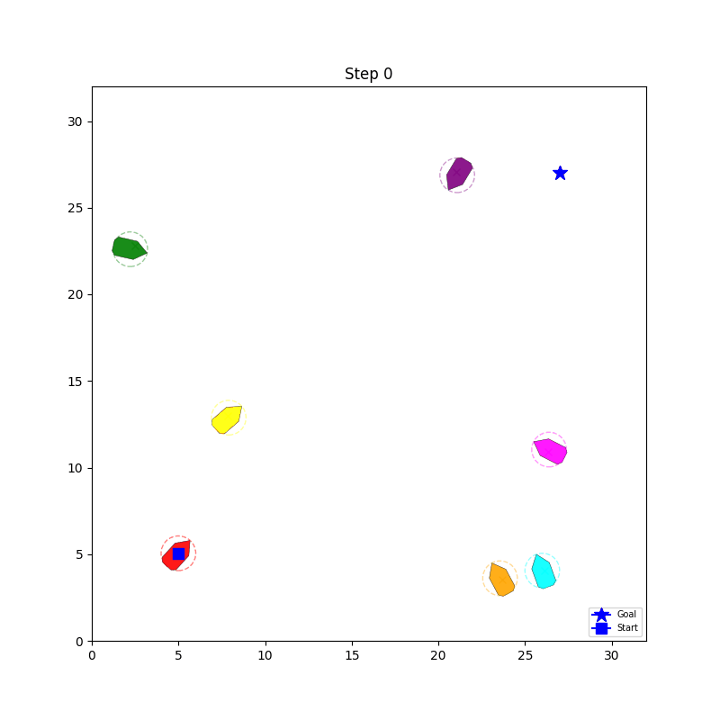

# CWVL-CoReCBF

Core research code for credibility-aware value learning and safety-constrained unmanned surface vessel navigation under perception uncertainty.

  

The animation shows a representative dynamic multi-vessel navigation example, including online motion, collision avoidance, and goal-directed behavior.

## Overview

This repository accompanies the paper *Credibility-Aware Learning and Control for Safe USV Navigation under Perception Uncertainty*. It contains the core implementations of CWVL, CoReCBF-QP, the COLREGs-aware execution components, the evaluated learning baselines, and the COLREGs-MPCC controller.

## Repository Structure

| Path | Description |
|---|---|
| `simple_boat/` | USV environment, dynamics, perception models, learning components, safety controllers, and map generators. |
| `scripts/` | Map, cache, training, and evaluation entry points. |
| `configs/` | Representative experiment and evaluation configurations. |
| `docs/` | Public project documentation, result summaries, and the animation asset. |
| `tests/` | Core implementation and workflow tests. |

Documentation is maintained in the `docs/` folder.

## Code Entry Points

- Map construction: `scripts/generate_final_maps.py` and `scripts/generate_obs7_10_maps.py`
- Replay-cache construction: `scripts/precompute_kf_cache.py`
- Five-seed training: `scripts/run_ppo_family_multiseed.py` and `scripts/run_drl_vo_lag_u_multiseed.py`
- Unified policy evaluation: `scripts/eval_transfer.py`
- COLREGs-MPCC evaluation: `scripts/eval_colregs_mpc_baseline.py`

Selected result summaries are available under `docs/output/`.

## License

This project is released under the MIT License. See `LICENSE`.
